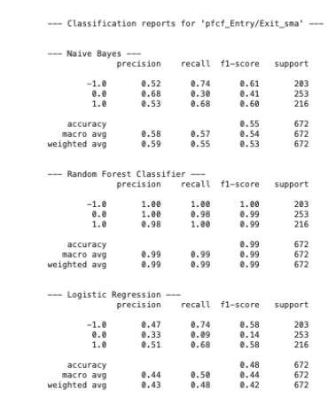
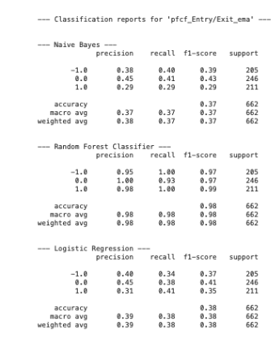

# Quant-Investing A Fundamental Guide #
# Team members:
Ravi Chailertborisuth 
Jack Richey
Krish Nair
Antonio Medina

## Project Objective ##
To compare and see which strategy yields the highest return? Technical Quant-trading
(using financial ratios), technical Trading (price), or buy-and-hold Trading strategy.
Using sklearn and machine learning to identify buy, hold, and sell signals using technical
analysis and financial ratios. Our work extends from class where we used price signals to
buy and sell securities, we take it a step further to understand to what extent can
fundamental price and liquidity ratios for example: Price/Sales, Price/Free Cashflow to the
Firm, Price/Earnings, Debt/Equity to buy or sell.

Jupyter Lab file(s) name(s):
*New Library:  TA-Lib - Technical Analysis Library and sklearn.naive_bayes import GaussianNB

## Data Gathering and Ratios
#### Data Import ###
All data is for daily prices or rates from January 2nd 2019 to April 1st  2024. Using the following sources.
Koyfin CSV
Data: Daily Adjusted Closing Prices (& daily close data)
Ratios: P/S, P/E , P/FCFF. 

### Assets  for our project analysis ###

- NVDA - Tech/Hardware Semiconductor
- Google - Tech/SaaS
- 3M – Conglomerate
- P&G - Consumer Staples

## Company selection process ##
These films were uniquely chosen to test the ML algorithm’s ability to generate returns on high to low stock volatility. NVDA was chosen to represent an ultra-high growth firm with rapidly improving fundamentals (1.5+ beta). Google was picked to represent a high growth company with near market performance (1.0 beta to the SPY), 3M represents a slow growth / fundamentally stricken company. P&G represents slow and consistent growth (0.40 beta). 

We will be testing the limits of our ML model performance on each of the stock prices and ratios. To determine how effective the model is based on companies with varying degrees of volatility and movement. 

## Price and Ratio benchmarks ##
Our jupyter notebook coding starts by importing all necessary libraries and then reading the CSV files containing both price and ratio data for our assets evaluation.  For the price, the code creates the data frames used by slicing the data in the csv files and creating the signals’s data frame using the closing price information.  For each asset dataframe a signal column is created for 0 or 1 where 1 is when sma-fast is greater than sma-slow or ema=fast is greater than ema-slow and 0 otherwise..  The code  then identifies the entry/exit signal based on the difference of the previous sma or ema signal.  The entry and exit points are calculated for SMA and EMA.	

### Price Benchmark ###
#### Sample Entry/Exit for SMA/EMA Adj. Close

For Price SMA, we calculated SMA FAST 10 SMA SLOW 100 and  SMA FAST 30 SMA SLOW 100.

The following graph represents 1/200 graphs and shows sample entrance and exit per asset (SMA/EMA) 

The code then make an investment capital tracker for each approach to visualize and compare the different approaches. 

Price SMA/EMA: EMA 30/100 had best results

## Ratios ###
Our jupyter lab notebook code then applies the same approach for SMA, EMA, RSI and BB as with the price but  for the following ratios: (In general, the lower the ratios the more attractive the investment)(3)
 The price-to-sales ratio (P/S): it measures  how much the market values every dollar of the company's sales. One of the advantages of using the P/S ratio is that sales are much harder to manipulate than earnings. Since a company's sales are generally more stable than its earnings level, any large changes in the P/S ratio are often more likely to indicate a departure from the intrinsic value of the company. (1)(2)
P/S Ratio=MVS/SPS           Where:MVS=Market Value per Share         SPS=Sales per Share​ 

  Price-to-earnings ratio (P/E):  The P/E ratio gives investors an idea of what the market is willing to pay for the company's earnings. The ratio is determined by dividing a company's current share price by its earnings per share.(1).  It measures  the willingness of investors to pay to the stock now. For our project we are doing a12 month trailing ratio.  A high P/E ratio may mean the stock is overpriced and a low P/E that it may be undervalued based on earnings. (1)(2)

P/E Ratio=Market value per share​/ Earnings per Share 

 Price-to-free-cash flow ratio (P/FCF): Price to free cash flow (P/FCF) is an equity valuation metric that compares a company's per-share market price to its free cash flow (FCF). It is ore precise than other CF ratios because it subtracts capital expenditures (CAPEX) from a company's total operating cash flow, thereby reflecting the actual cash flow available to fund non-asset-related growth. (3)   
Free cash flows or market caps that are non-typical for a company's size and industry should raise the flag for further investigation. 

​Price to FCF=Market Capitalization​​/Free Cash Flow

The following is a sample Entry/Exit for SMA/EMA P/Free Cash Flow. (All other signal graphs per asset are coded in the notebook for comparison)

The following is the Portfolio Value for the best Ratio strategy:

### Data-Cleaning: Setup for ML 
Pulling data from CSV: Price and Ratio data 
Generating signals for price data (exclusively) and Ratio Data 
Plotting price charts based on EMA 10 & 30 and SMA 10 & 30.
Generated up to 200+ plots combination of: 
EMA/SMA based on price (adj. close)
EMA/SMA based on ratios (P/S P/FCFF and P/E) 
Resampling: The code uses  SMOTEEN combination sampling. Over-sampling using SMOTE and cleaning using ENN (6)

### Model Results: Random Forest, Logistic Regression and Naive Bayes for Ratios. 

We ran each model and created a classification report for evaluation and comparison. The code also resamples the classes in the dataset as they were unbalanced. Since the  classes in a dataset we not  equally represented we used  SMOTEEN combination sampling. Over-sampling using SMOTE and cleaning using ENN (6)

Random Forest:
A supervised learning method use primarily for classifications and regression problems.  Random forest, complex trees tend to overfit to the training data and do not generalize well to new data. random forest algorithm will sample the data and build several smaller, simpler decision trees (4). 

Logistic Regression 
A logistic regression model predicts a dependent data variable by analyzing the relationship between one or more existing independent variables.It then uses this relationship to predict the value of one of those factors based on the other. The benefits of the logistic regression model are its speed, flexibility and visibility.  It can manage large data sets, provides a binary outcome and can also help in preparing data before the application of a ML model. (9)

“Logistic Regression measures the relationship between the dependent variables and one (or more) independent variables by estimating the probability of occurrence of an event” 

Naive Bayes 
The Naïve Bayes classifier is a supervised machine learning algorithm that is used for classification tasks. The model uses principles of probability to perform classification tasks. It assumes that predictors in a Naïve Bayes model are conditionally independent, or unrelated to any of the other features in the model. It also assumes that all features contribute equally to the outcome.(8)

Classification reports with binary Classification Predictions evaluation
There are four possible outcomes of a binary classification prediction.
True Positive: When we predict a class (positive) and are correct in that prediction.
For example, we predict someone has cancer, and they do.
True Negative: When we predict a class (negative) and are correct in that prediction.
For example, we predict someone doesn’t have cancer, and they don’t.
False Positive: When we predict a class (positive) and are incorrect in that prediction.
For example, we predict someone has cancer, but they don’t.
False Negative: When we predict a class (negative) and are incorrect in that prediction.
For example, we predict someone doesn’t have cancer, but they do.

Accuracy: Proportion of correct calls.
Accuracy = (TP + TN)/(TP + TN + FP + FN).
Precision:  The proportion of positive calls that are correct. A model with no FPs has perfect precision
Precision = TP/(TP + FP), 
Recall is the  proportion of truly positive samples that were correct. Recall is a critical metric for optimizing a model with unbalanced data. A model with no FNs has perfect recall
Recall = TP/(TP + FN)
F1 score is a useful metric for measuring the performance for classification models when you have imbalanced data because it takes into account the type of errors — false positive and false negatives.

#### Model Results and Classification Reports
The following is a sample Classification Reports for ratio P/FCFF 3M SMA & EMA. All other classification reports are generated in the Jupyter Notebook code.

### SMA

### EMA 

Graphs: Investing On the different Ratios Visualization. P/FCF is best ratio strategy. P/S ratio under-performed the most P/Free Cash Flow outperformed the most (on over average). However, Ratios overall still underperformed price-movement 

Entry Exits of SMA’s and EMA’s (Investment Value) 

Opportunities for Improvement and Next steps
-How would could we built a model  to manage a multi asset  asset approach at one time? 
-How to combine signals and average multiple ratios -Normalization?Would it benefit the model?
-How we may combine the classification report metrics across assets?
-How can we train the model using all signals? 
-Changing assets may show ratios as a better tool for the analysis.

### Resources ###

https://www.fidelity.com/learning-center/trading-investing/fundamental-analysis/company-valuation-ratios#:~:text=Price%2Dto%2Dearnings%20ratio%20(,by%20its%20earnings%20per%20share.
(2)https://www.schwab.com/learn/story/five-key-financial-ratios-stock-analysis#:~:text=Learn%20how%20these%20five%20key,understand%20a%20stock's%20true%20value
(3)	https://www.investopedia.com
(4) Fintech Bootcamp Class Materials
      (5).Fintech Bootcamp Tutor Session (Overall Review)
     (6)  investopedia P/Shtttps://imbalanced-learn.org/stable/references/generated/imblearn.combine.SMOTEENN.html
(7) https://www.ibm.com/topics/naive-bayes
(8) https://aws.amazon.com/what-is/logistic-regression/
	
